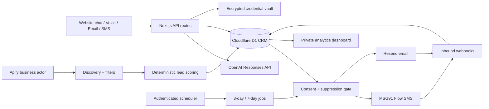

# ClearFlow production architecture

Deployment: India · Timezone: Asia/Kolkata · Owner: Clear Web Solutions

## System design

The deployed system is a modular Next.js application on OpenAI Sites with a Cloudflare Workers runtime and D1. Provider adapters are isolated behind API routes, so discovery, AI, SMS, email, voice, storage, and scheduling can be changed independently.

## Workflow

1. Search Apify by city and category from Lead CRM.
2. Exclude closed businesses and known large chains; apply rating, review-count, and website filters.
3. Review and bulk-import results.
4. Calculate a 0–100 score, website need, business potential, digital gaps, pitch angle, and priority.
5. Store source and refresh time. Public listing details never create marketing consent.
6. Require channel-specific consent and a clear suppression check before email or SMS.
7. Send through Resend or an approved MSG91 Flow template and store the provider message ID.
8. Schedule day-3 and day-7 jobs. A reply or opt-out cancels pending follow-ups.
9. Mark replies warm; mark opt-outs not interested and permanently suppress that channel.
10. Aggregate lead, message, reply, interest, win, and conversion metrics.

The support assistant uses English, Hindi, or Hinglish; explains the approved ₹999–₹18,999 range; progressively collects contact and business details; and hands off sensitive or uncertain requests.

## Database schema

| Table | Main responsibility |
|---|---|
| `businesses` | Listing facts, contact data, website, rating/reviews, source, refresh timestamp |
| `leads` | CRM stage, services, budget, scores, gaps, pitch, next action, notes |
| `consents` | Verifiable per-channel permission, source, proof, text version, timestamps |
| `suppressions` | Unique per-lead/per-channel do-not-contact enforcement |
| `messages` | Direction, channel, body, provider ID, status, campaign, delivery timestamps |
| `followup_jobs` | Day-3/day-7 run time, status, attempts, idempotency key, last error |
| `events` | Immutable analytics and audit facts |
| `vault_secrets` | AES-GCM ciphertext and IV only |
| `provider_connections` | Safe connection state, last test, sanitized error |

Unique indexes protect listing IDs, business leads, provider messages, follow-up jobs, and suppressions from duplicates.

## API structure

| Route | Purpose |
|---|---|
| `GET/POST /api/leads` | List, create, score, and store leads |
| `POST /api/discovery` | Run filtered Apify discovery |
| `POST /api/support` | Generate a grounded multilingual reply |
| `POST /api/consents` | Record consent proof |
| `POST /api/outreach` | Eligibility-check and send MSG91 SMS or Resend email |
| `POST /api/webhooks/sms` | Authenticate and normalize SMS replies/opt-outs |
| `POST /api/webhooks/email` | Authenticate and normalize email replies |
| `POST /api/webhooks/voice` | Optional Twilio speech support |
| `POST /api/jobs/followups` | Authenticate cron and recheck due follow-ups |
| `GET /api/analytics` | Funnel and conversion metrics |
| `GET/POST/DELETE /api/connections` | Test, encrypt, update, or remove credentials |

## Automation and security

- Discovery defaults to rating 4.0+, 100+ reviews, no linked website, and 25 results; the server caps one request at 100.
- Scoring is rules-first. AI cannot invent audit findings, recipients, prices, or consent.
- Initial outreach requires explicit recorded consent for that channel and no suppression.
- SMS uses a DLT-linked MSG91 Flow template. Email uses a verified Resend sender and idempotency key.
- Initial sends create unique day-3/day-7 jobs; replies and opt-outs cancel them atomically.
- STOP, UNSUBSCRIBE, Hindi, and Hinglish opt-out phrases create a suppression.
- Cron uses a bearer secret. Inbound webhooks support provider-specific secrets and provider-message deduplication.
- Provider credentials are tested, then AES-GCM encrypted with a managed `VAULT_MASTER_KEY`; plaintext is never returned to the browser or stored in Git, CRM, analytics, or AI context.
- The hosted dashboard is private and owner-only. Credential writes are same-origin only.

## Scaling and cost control

- Schedule independent city/category discovery runs; D1 deduplicates the listing ID.
- Use batches of 25–100 to control Apify spend.
- Start with bounded cron batches. Move dispatch jobs to Cloudflare Queues for sustained concurrency and back-pressure.
- Enforce provider rate headers, exponential retry with jitter, quiet hours, and per-contact frequency caps in the dispatcher.
- Archive old events/messages to object storage as retention volume grows; keep aggregates in D1.
- Shard workers by city or campaign without changing the CRM schema.

## Launch sequence

1. Add fresh OpenAI and Apify keys through Connections.
2. Verify a Resend domain and sender.
3. Complete DLT registration and approve the MSG91 sender and Flow template.
4. Configure authenticated inbound webhooks.
5. Import consent proof before activating outreach.
6. Configure the scheduler and run controlled follow-up tests.
7. Review India privacy, DLT, commercial-communication, retention, and call-recording obligations with qualified counsel.
