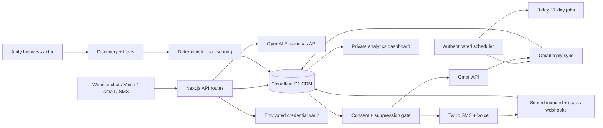

# ClearFlow production architecture

Deployment: India · Timezone: Asia/Kolkata · Owner: Clear Web Solutions

## System design

The deployed system is a modular Next.js application on OpenAI Sites with Cloudflare Workers and D1. Provider adapters remain isolated so discovery, AI, email, SMS, voice, storage, and scheduling can scale independently.

## Workflow

1. Search Apify by city and category from Lead CRM.
2. Exclude closed businesses and known chains; apply rating, review-count, and website filters.
3. Review and bulk-import the results.
4. Calculate a 0–100 score, website need, business potential, gaps, pitch angle, and priority.
5. Store listing source and refresh time. Public contact data never creates marketing consent.
6. Require channel-specific consent and no suppression before email, SMS, or commercial calls.
7. Send email with Gmail API, messages with Twilio SMS, or AI calls with Twilio Voice.
8. Store provider IDs and consume signed Twilio delivery/call callbacks.
9. Schedule day-3 and day-7 jobs for email/SMS. Replies and opt-outs cancel pending jobs.
10. Synchronize Gmail inbox replies; mark matched leads warm and update analytics.

The support assistant uses English, Hindi, or Hinglish; explains the ₹999–₹18,999 approved range; progressively collects business and contact details; and hands sensitive or uncertain requests to a person.

## Database schema

| Table | Main responsibility |
|---|---|
| `businesses` | Listing facts, contact data, website, rating/reviews, source, refresh time |
| `leads` | CRM stage, requirements, budget, scores, gaps, pitch, next action, notes |
| `consents` | Verifiable per-channel permission, source, proof, text version, timestamps |
| `suppressions` | Unique per-lead/per-channel do-not-contact enforcement |
| `messages` | Direction, channel, body, provider ID, delivery/call status and timestamps |
| `followup_jobs` | Day-3/day-7 run time, status, attempts, idempotency key, last error |
| `events` | Immutable analytics and audit facts |
| `vault_secrets` | AES-GCM ciphertext and IV only |
| `provider_connections` | Safe provider state, last test, and sanitized error |

Unique indexes protect listing IDs, leads, provider messages, follow-up jobs, and suppressions from duplicates.

## API structure

| Route | Purpose |
|---|---|
| `GET/POST /api/leads` | List, create, score, and store leads |
| `POST /api/discovery` | Run filtered Apify discovery |
| `POST /api/support` | Generate a grounded multilingual reply |
| `POST /api/consents` | Record consent proof |
| `POST /api/outreach` | Eligibility-check and send Gmail, Twilio SMS, or Twilio Voice |
| `GET /api/oauth/gmail/start` | Begin Google OAuth with signed, expiring state |
| `GET /api/oauth/gmail/callback` | Exchange the code and encrypt Gmail offline access |
| `POST /api/jobs/gmail-sync` | Pull recent Gmail replies into CRM |
| `POST /api/webhooks/sms` | Validate and normalize Twilio SMS replies/opt-outs |
| `POST /api/webhooks/voice` | Validate and run the Twilio AI speech flow |
| `POST /api/webhooks/twilio/status` | Validate delivery and call status callbacks |
| `POST /api/jobs/followups` | Authenticate cron and recheck due follow-ups |
| `GET /api/analytics` | Funnel and conversion metrics |
| `GET/POST/DELETE /api/connections` | Test, encrypt, authorize, or remove credentials |

## Automation and security

- Discovery defaults to rating 4.0+, 100+ reviews, no linked website, and 25 results; the server caps requests at 100.
- Scoring is deterministic. AI cannot invent audits, consent, prices, or recipients.
- Gmail uses Google’s server-side OAuth flow, signed expiring state, offline access, encrypted refresh tokens, and the minimum send/read scopes required for reply sync.
- Twilio uses HTTP Basic authentication for outbound APIs and HMAC-SHA1 signature verification for inbound webhooks.
- Email/SMS outreach requires explicit recorded consent, no suppression, channel rate limits, and a six-hour per-contact cap.
- Voice outreach requires separately recorded voice consent and does not schedule automated repeat calls.
- Twilio transient failures retry with exponential delay and jitter; status callbacks update delivery/call state.
- Gmail inbox synchronization and follow-up processing require `CRON_SECRET` bearer authorization.
- STOP, UNSUBSCRIBE, Hindi, and Hinglish opt-outs create a channel suppression and cancel follow-ups.
- Credentials are AES-GCM encrypted with a managed `VAULT_MASTER_KEY`; plaintext is never returned to the browser or stored in Git, CRM, analytics, or AI context.
- Disconnecting Gmail revokes its Google refresh token before encrypted values are removed.
- The hosted dashboard is private and owner-only; credential writes are same-origin only.

## Scaling and cost control

- Schedule independent city/category Apify runs and deduplicate on listing ID.
- Keep discovery batches at 25–100 to control spend.
- Run Gmail reply sync and follow-up processing in bounded cron batches.
- Move dispatch jobs to Cloudflare Queues when sustained throughput requires back-pressure.
- Respect Gmail account limits and Twilio Calls Per Second, messaging limits, quiet hours, DND/UCC rules, and per-contact frequency caps.
- Archive older message/event data as retention volume grows while keeping aggregates in D1.

## Launch sequence

1. Add fresh OpenAI and Apify credentials through Connections.
2. Enable Gmail API, create a Google OAuth Web client, and add the production callback URI.
3. Save the Google client credentials and authorize the intended Gmail mailbox.
4. Add Twilio SID/token, SMS sender, and voice caller ID.
5. Configure the Twilio number’s inbound SMS and voice webhooks.
6. Choose Twilio’s compliant India SMS route and complete DLT registration where required.
7. Import channel-specific consent before sending messages or calls.
8. Configure Gmail sync and follow-up schedulers.
9. Review India privacy, UCC/DLT, retention, and call-recording obligations with qualified counsel.
